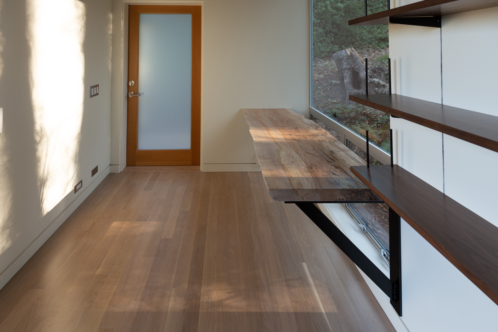

import Icon from "../../components/icon.tsx";
import Tag from "../../assets/icons/tag.svg";

<!-- Opener -->

 <!-- Evening exterior w/ Felix -->

<!-- Intro -->

  

## Writer's cottage

  

_March 2019_

Perched among the trees behind the main house, the cottage is designed to be a year-round creative space for one.
With floor-to-ceiling windows, its calm, light-filled environment provides just enough space for a typewriter, plenty of books, and a couch.
The desk was sourced from a tree that was taken down when the adjoining house was built.

All images by Robin Giese / GRUMPYCORP.

  

  

  

 <!-- Exterior positioning relative to backyard -->

  

<!-- Interior shots -->

  

 <!-- Interior from front door -->

  

  

 <!-- Interior from opposite wall -->

  

  

 <!-- Exterior siting -->

  

  

 <!-- Exterior positioning relative to house -->

  

  

 <!-- Artsy light -->

  

  

 <!-- Looking up -->

  

  

 <!-- Trim detail -->

  

  

 <!-- Winter -->

  

<!-- Closing shots -->

 <!-- Artsy desk+chair shot -->

<!-- Closing para -->

  

Design and construction by Robin Giese / GRUMPYCORP
based on design and architecture by [BUILD LLC](https://www.buildllc.com)
for the adjoining house.

For more about the design and construction process,
see the [<Icon sprite={Tag} className="h075" /> cottage](/tags/posts/cottage) post series.

  

  

  

