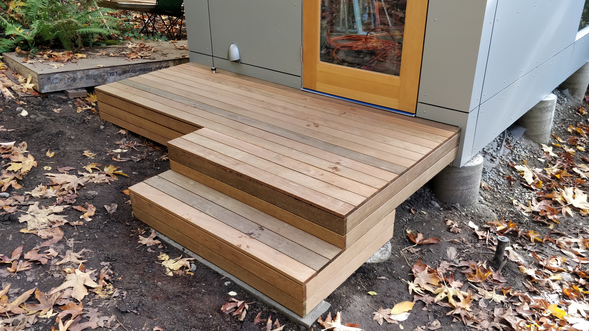

I needed to build a stoop in front of the door. Thankfully we had one on the main house for a back door so I had a design to steal ("model after").

The frame was initially a simple 3' job hung off a pressure-treated ledger board mounted to the sheathing and terminating in pressure-treated posts set into concrete.
I built this while doing the siding since 1/ I wanted a break from the siding project, and 2/ I needed it to make the siding install of the door elevation easier.

Having spent some time with it, though, I realized that a 3' deep stoop for a 3' wide out-swing door was just a bit awkward, and it needed an intermediate step down to the ground anyhow.
I used the opportunity of creating the step to also tack on a partial-width extension to the main decking surface, and build a nicely finished concrete pad since it was going to remain visible.
Per usual I covered the deck framing with Vycor just in case.

The decking material is 1x4 ipe just like on the main house. Using the ipe as trim for the sides is a somewhat pricey way of covering up the pressure-treated framing but it sure looks nice.
Ipe is time-consuming to work with since every screw needs to be not only pre-drilled but also pre-countersunk:
the cost of the nice tiny screw heads is that the tiny screws have no hope of cutting their own countersink.

Not shown: the considerable amount of planning required to get this to look slick and easy.
Even with that, a bunch of the vertically applied ipe needed to be ripped to subtly smaller widths; of course ripping it means you also need to re-round over the edges with a router, etc.
As per above, ipe is time-consuming to work with.

### Lessons learned

- Design it right the first time
- Pre-drill, pre-sink everything
