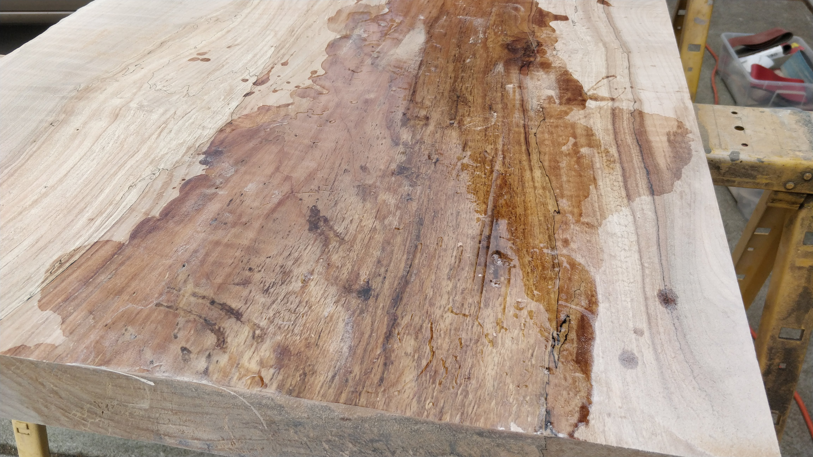
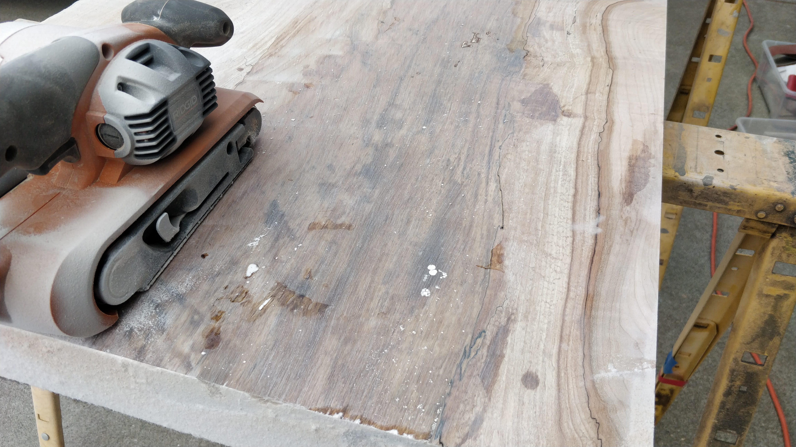
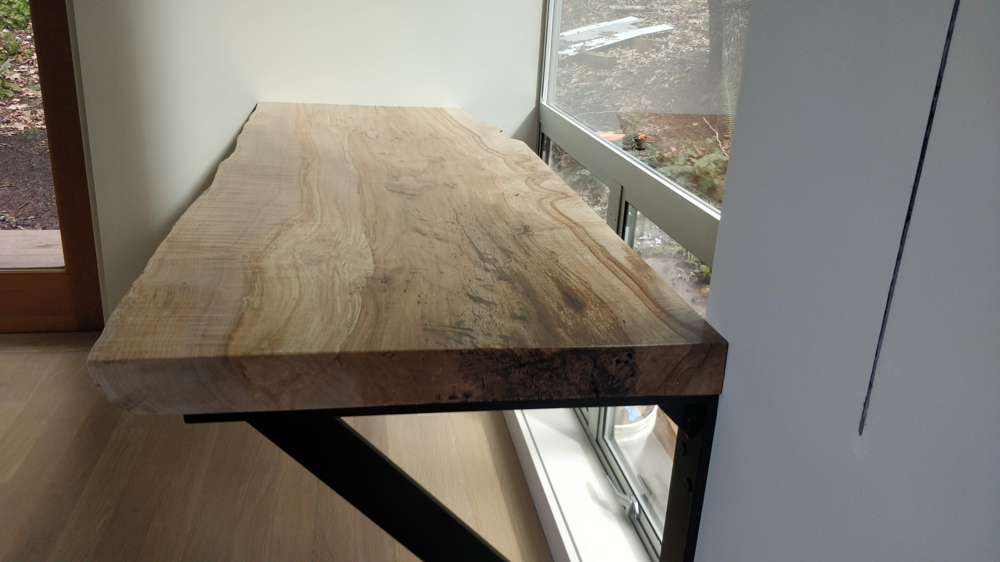

Being a _writer's_ cottage, there of course needed to be a desk.
I still had loads of wood slabs left from a tree we had to take down to build the house,
the same tree I'd fabricated our 4' x 12' dining table from.
For this desk I was able to use a single slab that didn't need glueing up since it was already between 22"-28" deep.

I started by setting up my rails-and-sled system again so I could use by router with a large end mill bit to plane the slab flat.
The rails are cutoffs from an old LVL left over from building the house so they're perfectly straight;
the sawhorses were carefully leveled out with shims and my big door hanging level to provide as flat a surface as possible without drastically more effort.
The original slab was 3" thick and needed to be planed down to 2-&frac12;" after warping during its roughly four year drying time.

Of course I managed to get the power cord of the router stuck in the sled's slot on one of the passes and moved through it.
Thankfully it just ate through the neutral wire and it was an easy repair.
To prevent this in the future and also to just generally make my life easier,
I spanned some tie line between the garage door rails and suspended my power cord from that with some pulleys and shackles.
It worked a lot better than just slinging it over my shoulder.

After a bunch of planing and sanding I filled the holes with a bunch of [System 3 General Purpose Epoxy](https://www.systemthree.com/products/general-purpose-epoxy-resin)
I had left over from the dining table project.
It took about eight separate pours to slowly fill the holes on the top, bottom, and side.

The System 3 epoxy seems reasonably forgiving of inexact mix ratios (I was probably +/- 10% on the ratio);
however, it's rather yellowing with the medium-speed hardener.
I'll try a different system for the next project just to see what else is out there.

It looked pretty narsty after curing but (as always) sanded up quite well with a hand-held belt sander.

From there I used a random orbital sander at 60, 100, 150, and 220 grit.

I had a bunch of finish left over from the [flooring project](/posts/cottage/flooring)
(i.e. [DuraClear Sealer](https://www.duraseal.com/products/sealers/duraclear-sealer/) and
[DuraClear Finish](https://www.duraseal.com/products/finishes/duraclear/) in satin) and gave that a whirl.

It ended up working pretty well; after the sealer coat I needed to re-sand with 220 grit on the random orbital
since it raised a bunch of grain. The top coat left a few more bubbles and imperfections in it than would be
appropriate for high-end/show room caliber work but it's good enough for me at the moment,
and it cured faster (<1 day vs. several days) and with less stink than my preferred oil-basd finish,
[Waterlox](https://www.waterlox.com/products-item/waterlox-original-penetrating-tung-oil-floor-sealer-finish).

We didn't need drawers etc. so I decided to just float the slab on steel supports for minimal visual and physical impact.
I welded up an angle bracket to hold the far side of the desk using some left-over &frac12;" x 2-&frac12;" steel,
spray-painted it with automotive paint, and attached it with
my favorite [HeadLok](https://www.fastenmaster.com/products/headlok-heavy-duty-flathead-fastener.html) high-load screws.

## Lessons learned

- Welding is fun but the actual welding is at best only 20% of the time spent on the project.
- Woodworking is fun but the actual wood work is at best only 20% of the time spent on the project.
  - Clean-up and setup prior to doing the work takes a while.
  - Simple things like routing power correctly takes a while.
  - Finish work is just the pits. No wonder there are experts who do nothing but wood finishing.
- Better tools and tricks raise the percentage of enjoyable work in any project.
  - I finally bought a [diamond-tipped blade](https://www.lenoxtools.com/pages/lenox-metalmax.aspx) for my
    metal cutoff saw instead of an abrasive blade and that reduced cutting time by 5x easily.
  - I wax the bottom surface of my router with cheap paste wax to reduce friction in the sled and it works wonders.
    - Recommended practice for all tools where there's any movement, e.g. planer, table saw, etc.
- If I were doing this more often, I'd want a finishing space (no dust, terrible smell) separate from a work space (all the dust).
  Having to "mode switch" the garage several times per project gets old.
