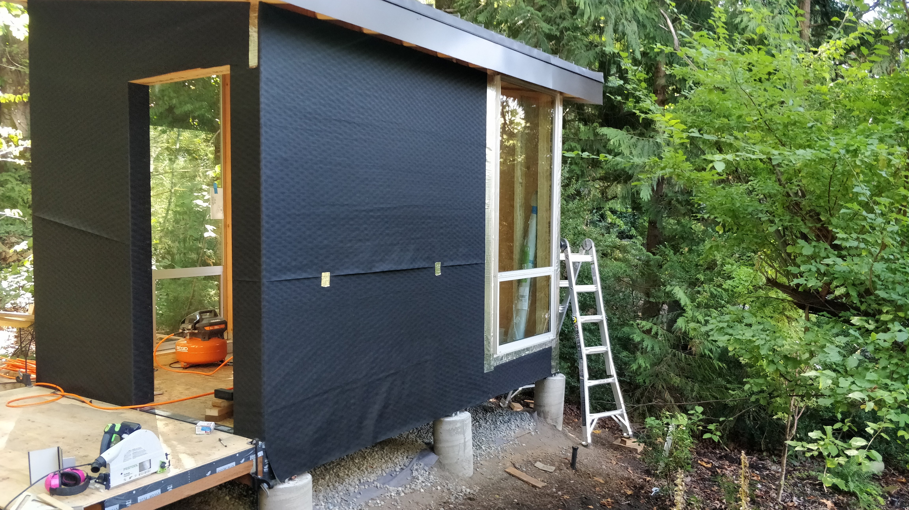
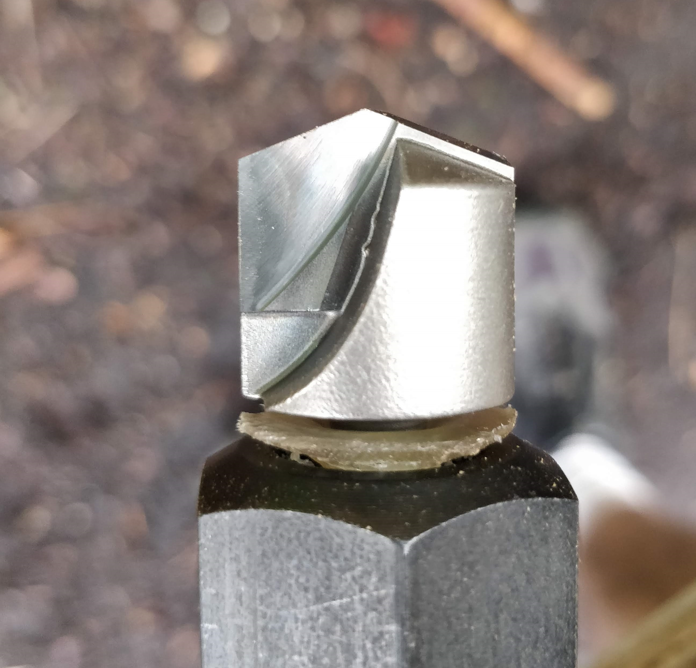
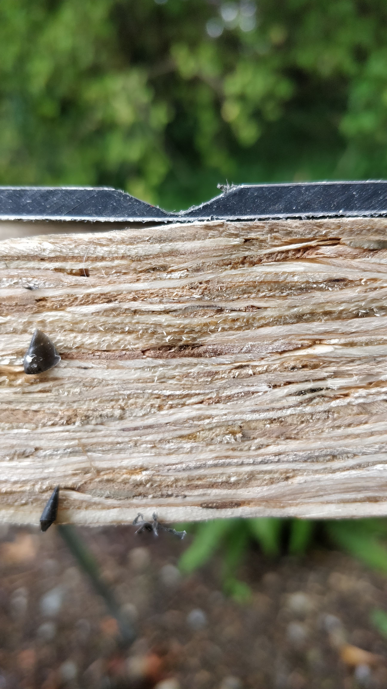
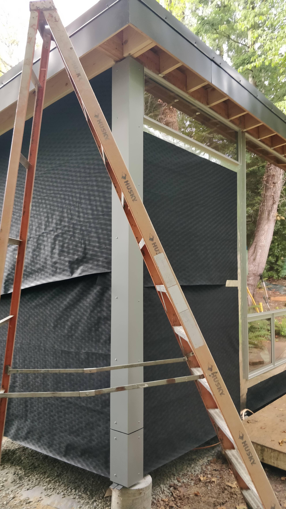

The siding of our main house is a mix of ultra-fancy composite aluminum panels (in silver and blue) and vertical tongue-and-groove cedar, all applied as a rain screen setup.

We had a number of the silver aluminum panels left over so I figured, how hard can it be. Very hard, it turns out - this took over a month, surpassing my wildest expectations of complexity.
Of course the siding is also the primary thing you see, both from our house and as you walk up to the cottage, so I wanted this to be perfect.

The first step in the journey was weather-proofing. Since this is an open joint application, i.e. sunlight reaches the water-resistant membrane through the roughly 1/4" joints in the panels,
the membrane needs to be designed for that.
[Build LLC](https://www.buildllc.com) used VaproShield for this purpose, but it wasn't available in small-enough rolls (I didn't feel like using the first hundred bucks off a six hundred dollar roll).
Instead I ordered [Benjamin Obdyke FlatWrap](http://www.benjaminobdyke.com/products/housewrap-flatwrap-uv) directly from the manufacturer and used about 70% of the roll.
Since it came from the same manufacturer, I used [HydroFlash](http://www.benjaminobdyke.com/products/hydroflash-self-adhered-flashing) as the corresponding self-adhered flashing.

The house wrap was perfectly pleasant to install. I tacked it on with a few staples but relied on the cedar rain screen runners (installed next) to really hold it in place.
The flashing, however, was just horrible to work with. Compared to my favorite, [Grace VycorPlus](https://gcpat.com/en/solutions/products/vycor-weather-barrier-flashing-tapes/vycor-plus),
it is much thinner and tears quite easily, far more tacky when installing (making installing longer runs of it e.g. along windows really difficult), but seemingly less tacky in the long run.

Next, it was time to install the cedar runners that would position the aluminum panels at the right distance from the water-resistant membrane.
I'd ordered a bunch of 1x4 green cedar from Dunn and split it into 1x2 on the table saw.
For the one wall that didn't have any openings, I just left it at the 3/4" depth that it came in.
For the two walls that had windows, I took half of the allotted stock and planed it down to just under 1/2" and sandwiched it on top of a 3/4" piece.
This would position the finished (front) depth of the aluminum panel to be in plane with the front of the window frames.

Next came the most difficult part of the project: bending corners into the composite aluminum panels. It's super-slick and agonizingly difficult.
Sure, you could also have open edged corners, but this is just so much nicer...

The panel material is a thin layer of anodized aluminum over a roughly 1/8"-thick plastic core with a second thin layer of aluminum layer on the backside for strength
(forming a stress skin panel). In order to create a bend, I needed to route a V-groove into the material from the back that left a tiny sliver of the plastic core behind.
I needed to use a blunt-tip groove bit with my router to give the outer aluminum sheet a somewhat gentle bend radius; with a 90-degree conventional tip bit, the aluminum just breaks.

I obtained the bit from our super-friendly and supportive supplier and panel manufacturer [Northwest Green Building](http://www.northwestgreenbuilding.com/) who as it happens
is also a former Microsoft employee. They manufacture these bits themselves by getting a commercially available sharp tip 135-degree bit and then blunting it to spec.

I routed the groove very carefully to just the right depth using the track from my Festool track saw as a guide.
After I got it adjusted just so, I measured the width of the groove as a proxy for its depth since that was easier and more accurate to measure.

Of course doing this on a full 10' tall corner piece instead of a little test piece is challenging because the saw horses I'd set up had a hard time keeping the piece flat while I was routing it.
As I routed more of a groove into it, it became less flat, thus changing the surface the router was riding on, and by extension the depth of the bit.

You really need to get the depth right by better than 1/32" of an inch:

- routed too deep: visible holes in the finished surface
- routed too shallow: too much bending stress causes stress fractures on the finished surface

...and that's a level of accuracy difficult to achieve without a dedicated build table.

After much labor, the first corner was fabricated and mounted. I back-filled the bend with some OSI silicone caulk for good measure.

Speaking of mounting, let's talk about screws. The panels are affixed with screws that are color-matched by the manufacturer, have nice wide heads, and a sensible Torx-20 interface.
Due to all of that they're also expensive at a buck and a quarter each (!).
Lastly, they are (obviously) quite visible as part of the finished product, so they need to be positioned precisely and consistently.
I followed the general design of the screw schedule of the main house: every 14"-17" vertically, every 18"-24" or so side-to-side, and 2" in from panel ends.
For each elevation (i.e. wall) the vertical positions of the screws needed to be perfectly consistent while their side-to-side spacing was dictated by the width of each panel.

Since the windows on the front and back walls were of different heights, given the shed roof layout, I settled on two screw schedules for those elevations.
In the photo of the corner above you can see that it has to use one screw schedule for one leg and a different one for the other leg.

Note also that it's wise to mark the screw schedule on the cedar runners before installing them so you don't randomly end up placing a screw holding the runner to the wall
right where you later want to place a screw holding down the panel. (Obviously this is a lesson from hard-won experience.)

The door to the cottage is an out-swing unit to preserve as much precious floor space inside as possible.
I chose to resolve the siding condition at the door jamb terminating the siding on top of the jamb with a 1/4" gap between the panel and the jamb.
I also held back the panel 1/4" from the interior edge of the jamb so it terminated right against the back side of the catch of the door latch.
I spray-painted the exterior portion of the door jamb silver to match the siding, and then used the ever-so-hateful HydroFlash to interface from the side of the jamb to the front of the water-resistant membrane.
I also previously rabbeted the inside of the jamb to receive the drywall L-bead but that's for another day.

The sheer complexity involved in figuring out what to do with that door was hours of head-scratching over many days. Like most good design, it looks trivial when completed, but the variables and constraints that needed to be considered were staggering.

Speaking of the door, the door slab needed to be finished prior to installation. I used some MinWax oil-based poly and it was terrible - I needed to strip it off and redo it twice;
once the stain pad I was using to apply the finish lost loads of little fuzzy hairs (never buy paint equipment from the big box store if you can avoid it),
and the second time there were just too many air bubbles in the finish. I should have just used a professional-grade finish instead of the big box store crap...

From this point forward it was just a lot of measuring, cutting, screwing, and so forth.

Well, not quite. I ran out of screws as I was doing the final, least visible wall (I'd expected this).
I didn't feel like buying another 250-pack of screws since I only needed another forty, so I bought some just-similar-enough stainless screws
from [McMaster-Carr](https://www.mcmaster.com/), part `93406A298` and spray-painted them silver to knock down the shiny stainless sheen and match the panels better.

Additional complexity was contributed by
the Panasonic [passive air intake](https://na.panasonic.com/us/home-and-building-solutions/ventilation-indoor-air-quality/ventilation-accessories/passive-inlet) (part `FV-GKF32S1`)
and [wall exhaust fan](https://shop.panasonic.com/support-only/FV-08WQ1.html) (part `FV-08WQ1`), respectively. I blocked around them with cedar of the appropriate depth,
flapped the weather-resistant barrier over some HydroFlash, and sealed that down with more HydroFlash - essentially the standard window flashing procedure applied at a small scale.
Then I mounted the panel and finally used a hole saw to cut the right opening through the panel, blocking, and sheathing at the same time,
somewhat reminiscent of the self-aligning patterning in my (brief) days of doing VLSI photolithography in college.

The PAI hood and fan hood were each spray-painted silver as well.

But eventually, it was all done.

### Lessons learned

- I'm getting a bit tired of every _Lessons learned_ section talking about taking the time to do it right the first time, but this is clearly another one of those.
  - Get a work surface that lives up to the accuracy required to do the work right. Two sawhorses on soil with some 2x6s thrown across them is not the right substrate for +/- 1/32" accuracy.
  - Fully plan out everything so nothing needs re-doing, especially when the materials you're working with a very expensive.
- Benjamin Obdyke's HydroFlash is just a huge pain to work with and I'd never voluntarily use it again.
- I ended up nailing a temporary horizontal runner underneath each panel to be installed so I could lift the panel into place, rest it comfortably while evaluating it for fit, and screw it on without fearing that I'd lose the proper position.
- Any cut edge on a panel really needs to be sanded over with a little foam center sanding block, both for visual consistency and finger health.
