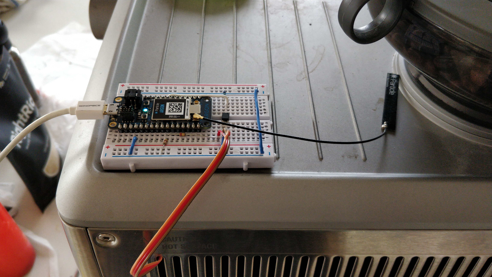
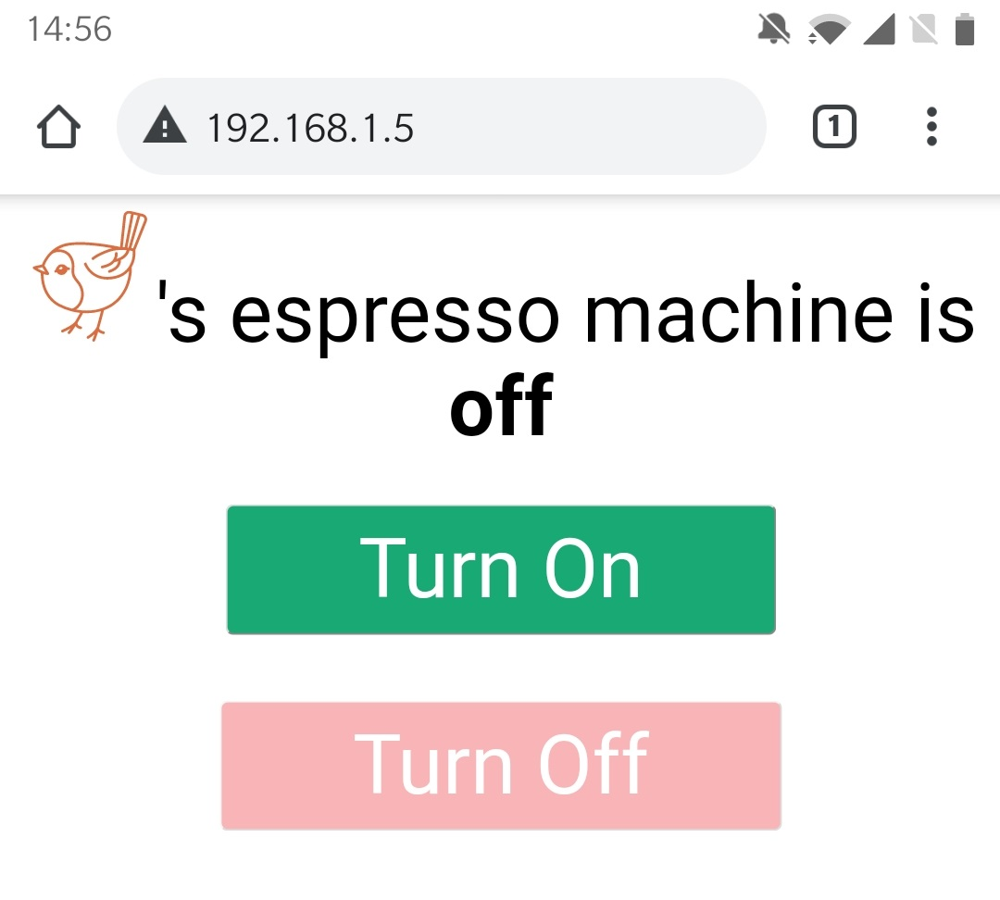
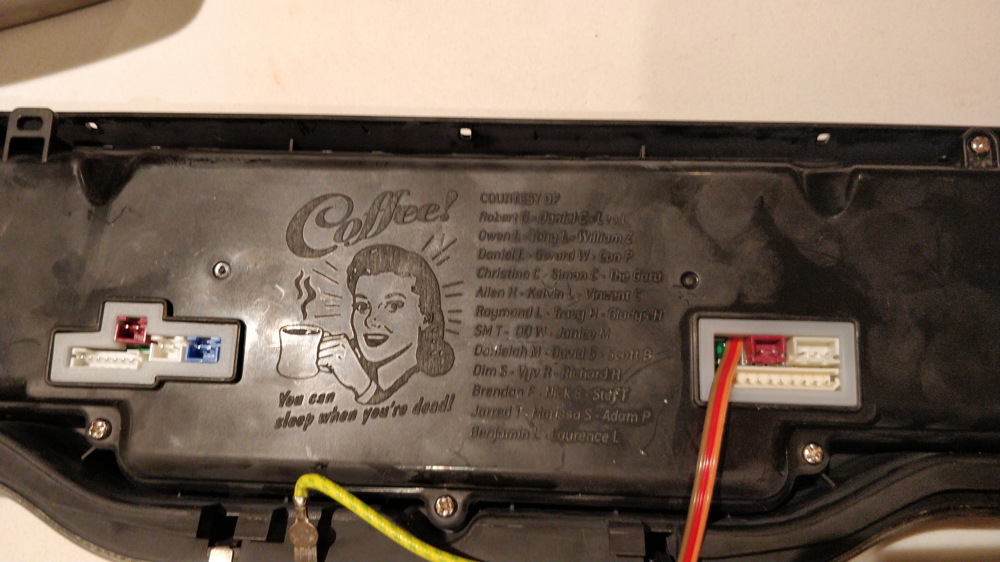

This project is a quick hack to allow me to turn on my Breville Oracle from bed.

## Installation

Solder three wires to the Breville UI board:

1. Pick up ground from the top left pin of the power switch
2. Pick up the switch signal from the top right pin of the power switch
3. Pick up the connection between the two power LEDs from the bottom pin of the right LED

Then connect to a Particle Argon as follows:

1. Connect ground to ground
2. Connect the switch signal via an SSR (I'm using a left-over TLP3122A from my [heating system project](https://www.grumpycorp.com/posts/warm-and-fuzzy/thermostat-design/)) to ground
3. Connect SSR to output pin (e.g. D7 which also gives me a free on-board LED on the Argon)
4. Connect the power LED sniffer to the top of a resistor bridge to reduce its voltage (I used a 220K / 47K since that's what I had floating around)

The Breville control board is always powered at 12V; sniffing the power LEDs' midpoint generally runs at ~10V
and dips to ~9V when the LEDs turn on.

Then build and flash [the code](https://github.com/rgiese/espresso-power/blob/main/src/espresso-power.ino) to the Particle Argon,
configure it with a static DHCP lease, and boom you're done:

Since this runs on our local network only I'm kind of ok with it being an open port 80 security nightmare.

Also, while I was in there, it was quite charming to notice that the Breville engineering team put some artwork and credits
on the inside of the machine:

