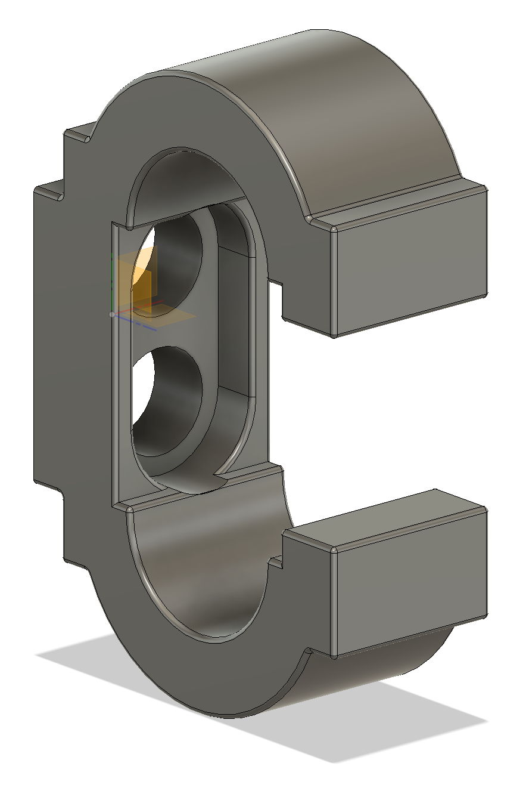
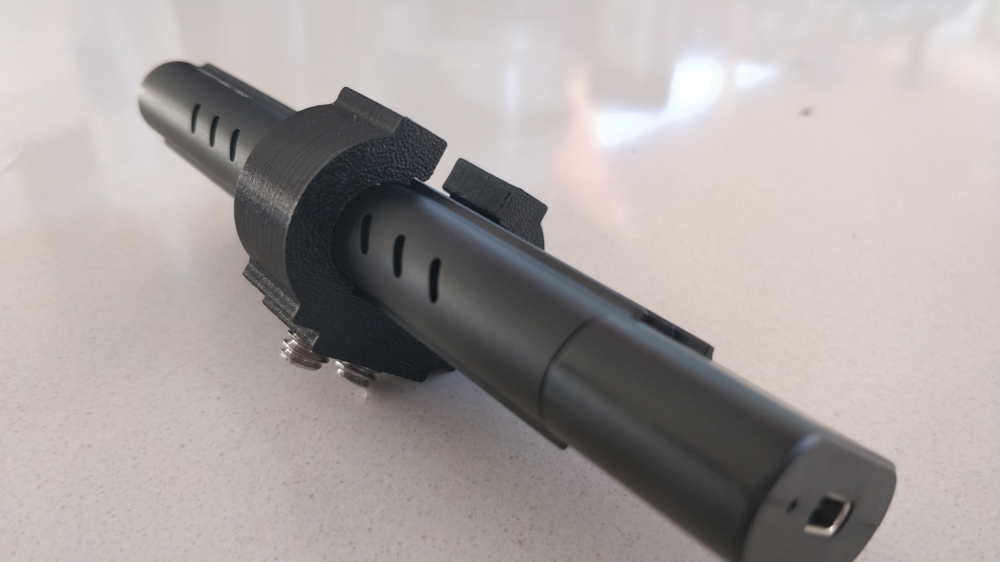
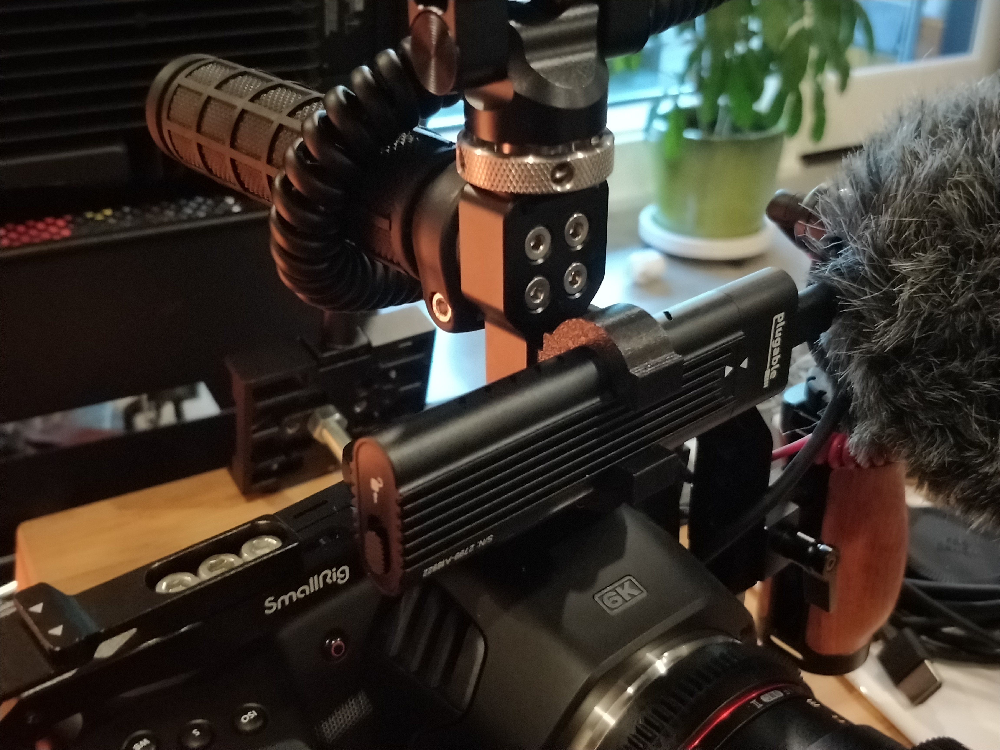

I bought a new camera and needed a way to mount my external storage, a [Plugable USB-C NVMe enclosure](https://plugable.com/products/usbc-nvme).

After spending a bunch of time browsing [SmallRig](https://smallrig.com)'s site I couldn't find anything that made me happy.

I realized I could just make something on my 3D printer, particularly since I'd been doing a bunch of CF-PETG prints of late,
so I whipped something up in Fusion 360 ([F3D](https://github.com/rgiese/www-grumpycorp-com/tree/master/src/content/posts/film%20making/images/NVMeClamp.f3d),
[STL](https://github.com/rgiese/www-grumpycorp-com/tree/master/src/content/posts/film%20making/images/NVMeClamp.stl)) and an hour of printing later we're done!

  

  

  

  

The material is perhaps a bit thick but I keyed the shell thickness to a design parameter so it's easy to change.

## Lessons learned

<!-- prettier-ignore-start -->
<!-- (Prettier escapes dollar signs poorly, or rather, its output is compliant with CommonMark but MdxJS parsing is not. Woot.) -->

Sometimes it's faster (less than two hours in all)
and cheaper ($0.30 of [PETG](https://atomicfilament.com/collections/petg-3d-printer-filament-us-made-with-free-shipping/products/carbon-fiber-black-petg-pro))
to just design and print something yourself.

<!-- prettier-ignore-end -->
