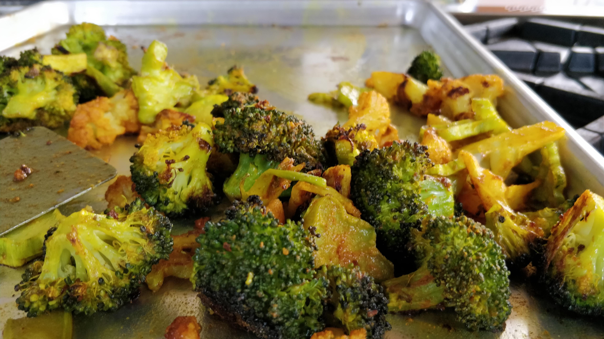

A few trivial techniques to make it easier to enjoy a vegetable-centric diet.

# Roast all the things

I haven't yet met a vegetable that wasn't improved by oven roasting.

Basic steps:

- Run a hot oven, generally 450F (230&deg; C)
- Coat veggies in ample high-temp oil and salt
  - We're using grapeseed oil from Costco
- Open the oven every handful of minutes to let water vapor escape
  - We're trying to brown the veggies after all, not steam them

## Carrots

My lazy bastard hack on carrots is to just buy them as matchsticks straight from the store. This way they cost about 3.5x as much as bulk carrots but

- I think it's worth an extra dollar to save the effort to shred them on the box grater
- They look and taste better cut into matchsticks rather than grated and I'm most definitely not taking this as an opportunity
  to showcase any knife work with hand-made matchsticks.

## Broccoli, cauliflower, &amp;c.

Broccoli is really the mainstay of our roasting operation here but cauliflower makes for a nice color addition.
If I feel like punishing future-me as the dishwasher I'll also toss them in some turmeric for added color
and some minor flavor improvement.

## On-the-fly aioli

The real fun comes from covering roast vegetables (or really anything) with a nice squeeze of flavored salt-acid-fat, a.k.a. aioli.
It takes three minutes to make (and another three to clean up after), lasts for weeks, and upcycles _meh_ to _yay_ instantly.

Aioli is no longer _just a shit-ton of garlic mashed up with oil to form a fluffy, vampire-repelling emulsion_, 
to quote [Bon Appetit](https://www.bonappetit.com/story/what-is-aioli). 
I simply toss some mayo into a small blender along with some garlic, lemon juice, salt, 
and spices from whatever direction of food I may to jibe with on a given day (za'atar, coriander, paprika, whatever).
Control viscosity with cream (one should always have cream).

One of several reasons why we buy mayo from Costco.

## Un-fresh ingredients

I've just about entirely switched to the un-fresh (frozen or refrigerated) versions of garlic and lemon juice.
This way I actually use them rather than skip them (meh, don't want to peel/squeeze _X_) and it makes for an altogether better meal.

### Garlic
We get [Christopher Ranch fresh peeled garlic](https://www.christopherranch.com/products/fresh-peeled-garlic/) from Costco and/or Cash-n-Carry
and freeze it right away. A bag lasts for many months, and I just use twice the called-for or imagined amount compared to fresh garlic.
Even with that, it's still cheaper than fresh garlic.

### Lemon juice
We get [Perricone Farms](https://perriconefarms.com/) lemon and lime juice by the bottle from Cash-n-Carry. 
It's by the far the best bottled lemon juice I've had, in part because unlike the grocery store nonsense it's sold chilled i.e. perishable i.e. fresher.

## Literature for improvisation

An execellent foundation for building flavors is Becky Selengut's [How to Taste](https://www.powells.com/book/-9781632171054).

And of course you can't write this sort of section without mentioning Karen Page's [Vegetarian Flavor Bible](https://www.powells.com/book/-9780316244183)
so there you go.