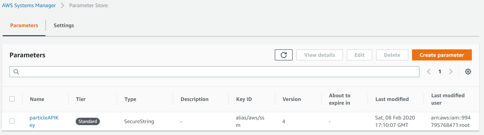

Whenever there's a change to the thermostat configuration or settings table, I have a
[Lambda](https://github.com/rgiese/warm-and-fuzzy/blob/master/packages/api/src/streams/thermostatConfigurationAndSettings/index.ts)
subscribed to those tables' streams to push the changed setting to the device in the field.
(This felt more reliable than making the API responsible for that - separation of concerns and all...)

In order to push that update, the code invokes a Particle webhook with the updated settings,
so the code needs to be able to authenticate to Particle with a Particle API token.

It's easy to pass environment variables to Lambdas via Serverless' infra-as-code,
but the Particle API token is a secret I need to rotate --
these tokens expire every three months (I have a recurring Google Calendar appointment to rotate them) --
and I didn't want to have to kick off a deploy for that.

There are many ways of going about this. There are many articles for this on the internet:
roughly half of them describe some way of doing it, and the other half describe why that's wrong.
The usual, basically.

What I settled on -- supposedly the least shady solution -- was to use
AWS Systems Manager (SSM)'s Parameter Store and connect it to AWS Key Management Service (KMS) for, well, key management.
Setting up the actual secret through the AWS UI was pretty trivial (everything is pretty much pre-connected)
and [this tutorial on Medium](https://medium.com/velotio-perspectives/managing-secrets-using-aws-systems-manager-parameter-store-and-iam-roles-429b6d5b13fb)
seems to describe it well enough by my recollection.

Making this work in code required some back-and-forth even though the end result looks easy,
so let me try and save any interested parties some time.

#### Step 1: Set up parameter in AWS SSM Parameter Store

Configure the parameter in AWS SSM (under AWS Systems Manager > Application Management > Parameter Store).
You'll notice that AWS SSM used to stand for _Simple Systems Manager_ - looking at their UX explains why they thought the better of it
and dropped the _Simple_ from their name.
At any rate, there seems to be just one SSM and KMS in any AWS account so there was nothing to be provisioned prior to doing this.



In my case, the name of the parameter is `particleAPIKey`,
brutally and mercilessly linebroken by the AWS UI above that refuses to allow for resizable columns using any of the mouse gestures I could imagine.
(The AWS Console UI really **lives** the _cheap as dirt_ value system that AWS seems to ascribe to.)

#### Step 2: Configure access to the parameter in `serverless.yml`

1. I created a `custom` value to capture the name of the SSM parameter value I set up in Step 1.
1. I then used that to grant my Lambda IAM role access to the parameter for reading, and to KMS for decrypting.
1. Finally, I passed the name of the parameter to my lambda as an environment variable.

```YAML
plugins:
  # Make the `#{AWS::AccountId}` magic work below
  - serverless-pseudo-parameters

custom:
  ...
  # Secrets management
  secretNameParticleAPIKey: "particleAPIKey"

provider:
  name: aws
  ...
  iamRoleStatements:
    ...
    # Give selective access to the given encrypted SSM keys
    - Effect: Allow
      Action: ssm:GetParameter
      Resource:
        - "arn:aws:ssm:#{AWS::Region}:#{AWS::AccountId}:parameter/${self:custom.secretNameParticleAPIKey}"
    - Effect: Allow
      Action: kms:Decrypt
      Resource: "arn:aws:kms:#{AWS::Region}:#{AWS::AccountId}:alias/aws/ssm"

functions:
  # DynamoDB Stream handlers
  streamThermostatConfigurationAndSettings:
    handler: src/streams/thermostatConfigurationAndSettings/index.dynamoStream
    environment:
      PARTICLE_API_KEY_NAME: ${self:custom.secretNameParticleAPIKey}
    events:
      - stream:
          type: dynamodb
          arn: !GetAtt ThermostatConfigurationTable.StreamArn
          batchSize: 1
          startingPosition: LATEST
  ...
```

#### Step 3: Retrieve value in code

```TypeScript
import AWS from "aws-sdk";

const SSM = new AWS.SSM();

export async function getParticleAPIKey(): Promise<string> {
  const keyName = process.env.PARTICLE_API_KEY_NAME;

  if (!keyName) {
    throw new Error("Configuration error: Particle API key name not provided.");
  }

  const response = await SSM.getParameter({ Name: keyName, WithDecryption: true }).promise();

  if (!response.Parameter || !response.Parameter.Value) {
    console.log(response);
    throw new Error("Configuration error: could not decrypt Particle API key.");
  }

  return response.Parameter.Value;
}
```

#### Step 4: Profit

Oh wait, there's no profit in any of this. Alas.

See GitHub for the complete [`serverless.yml`](https://github.com/rgiese/warm-and-fuzzy/blob/master/packages/api/serverless.yml) and
[Particle webhook ("function") calling code](https://github.com/rgiese/warm-and-fuzzy/blob/master/packages/api/src/streams/invokeParticleFunction.ts).
