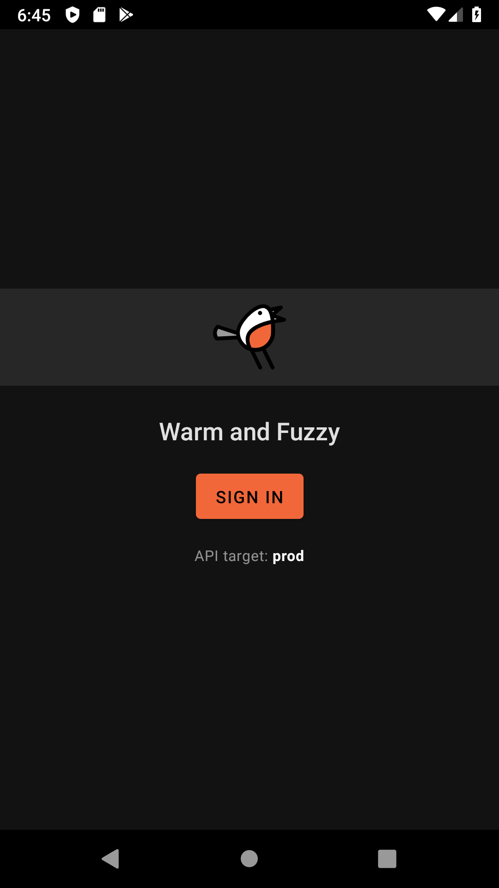
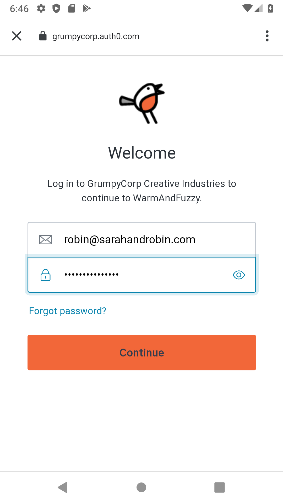
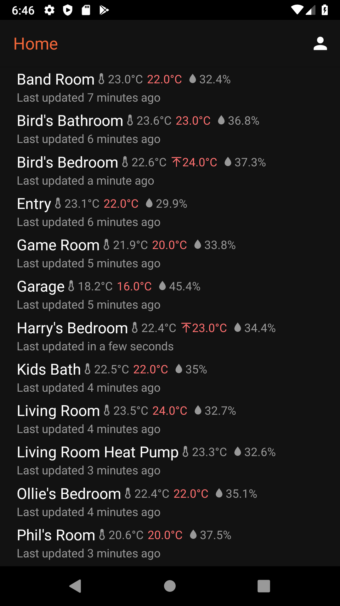
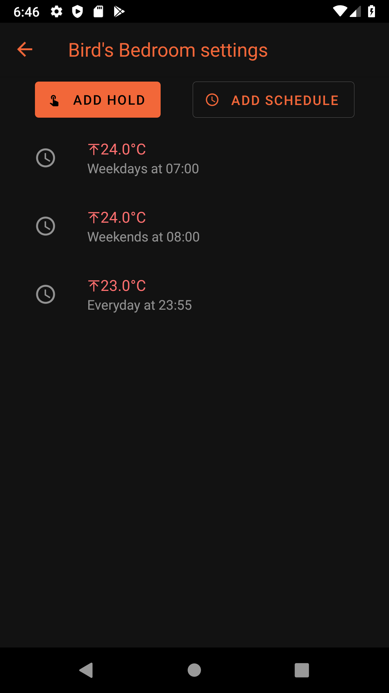
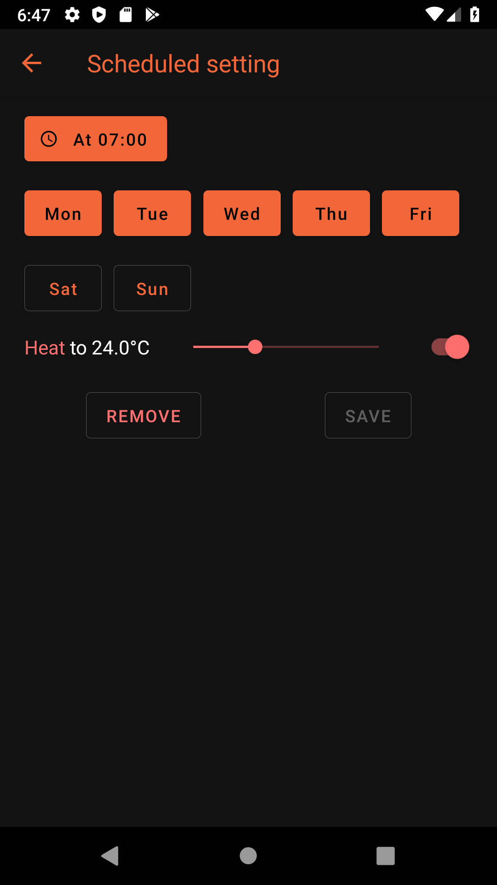
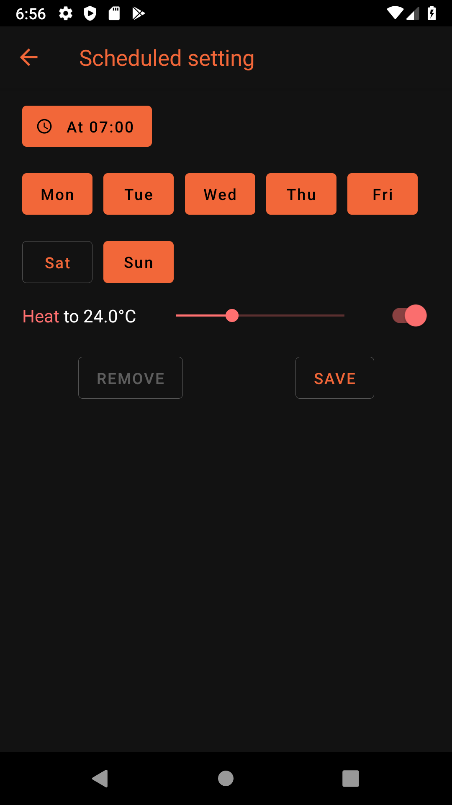
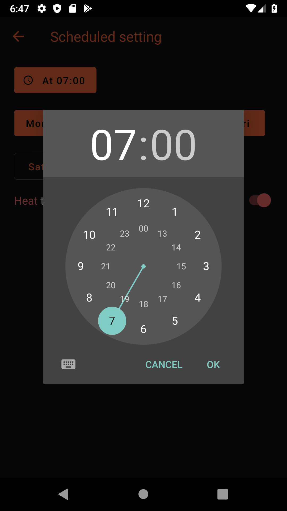
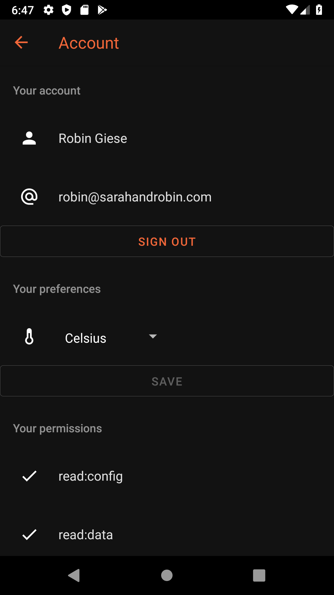
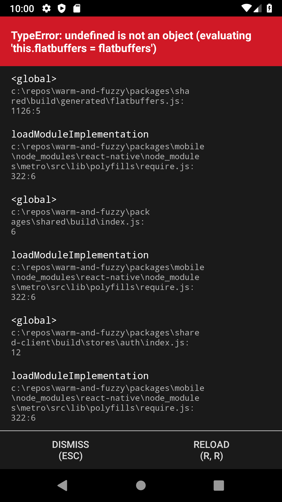

## Show me what you got

### Logging in

Prior to authenticating I take the opportunity to display my "fancy" "brand" imaging.

The login happens on an Auth0 web page hosted in an in-app browser - it's a bit jarring transitioning into this from
the otherwise dark mode-ish app, but whatever.

<div className="cf">
  <div className="fl-ns fn w-10-m w-50-ns pa1">



  </div>
  <div className="fl-ns fn w-10-m w-50-ns pa1">



  </div>
</div>

### Status

The main page gives a quick run-down of what every thermostat is up to,
including a description of what setpoints they're chasing and what actions they're taking.

Unlike the webapp, settings for each thermostat can be changed by clicking on any thermostat from the home page.
This felt like a more touch-friendly UX than porting the same concepts (and code, perhaps) from the web version.

<div className="cf">
  <div className="fl-ns fn w-10-m w-50-ns pa1">



  </div>
  <div className="fl-ns fn w-10-m w-50-ns pa1">



  </div>
</div>


### Settings

Touching any one setting opens up a dedicated screen for editing a given setting.

At the bottom of the screen for editing a setting is a _Remove_ and _Save_ button.
When the setting is unchanged, the _Remove_ button is enabled and when clicked will remove the setting without any further confirmation.
Once the setting has been changed, the _Save_ button is enabled and will similarly save the setting without any further confirmation;
the _Remove_ button becomes _dis_abled when the setting is changed to avoid letting a user accidentally delete a setting when they meant to save it.
Navigating back before saving just discards the edits.

<div className="cf">
  <div className="fl-ns fn w-10-m w-50-ns pa1">



  </div>
  <div className="fl-ns fn w-10-m w-50-ns pa1">



  </div>
</div>

Changing the time of day for a scheduled setting is nice and Android-ish courtesy of
[`@react-native-community/datetimepicker`](https://github.com/react-native-community/react-native-datetimepicker):

<div class="mw55-ns center">



</div>

### Preferences

Tapping the person-shaped icon at the top right of the home screen gets to the Account screen,
effectively a mix of account information, account preferences, and various debugging information.

<div class="mw55-ns center">



</div>

## How it's built

The web app is built using React and uses [`react-native-paper`](https://github.com/callstack/react-native-paper) as its foundational UX element library.

The data and state management is the same as for the web app and the level of code sharing is basically just glorious.

### In-app navigation

I use [`react-navigation`](https://reactnavigation.org/) for managing in-app navigation.
It's ... a bit of a trip. 
It all makes good sense until you want to configure the navigation options per screen and then things go a bit weird.

After much back-and-forth, the best approach seems to be to articulate a screen as implementing `NavigationStackScreenComponent<>`
rather than `React.FunctionComponent<>`, and then providing a static `navigationOptions` function like so:

```TypeScript
const HomeScreen: NavigationStackScreenComponent<{}> = (): React.ReactElement => {
  return (
    <BaseView>
      <ThermostatStatusTable />
    </BaseView>
  );
};

HomeScreen.navigationOptions = ({
  navigation,
  screenProps,
}: {
  navigation: NavigationScreenProp<NavigationRoute<{}>, {}>;
  screenProps: any;
}): NavigationStackOptions => ({
  title: "Home",
  headerRight: (): React.ReactNode => (
    <IconButton
      color={(screenProps as ScreenProps).theme.colors.text}
      icon="account"
      onPress={(): void => {
        navigation.navigate(ScreenRoutes.Account);
      }}
    />
  ),
});
```

This means you can't access state or computed values of a screen in its header
and my brain melted a bit thinking about how implementing something like a _Save_ button in the screen header
could be implemented. Ah well.

A nicer model might be to have the rendered elements include an element that defines non-static navigation options,
but that may just violate the top-down flow paradigm in React. 
I don't know what the right thing to do here is but it feels like dogma is taking precedence over practicality a little.

Also don't get me started on passing parameters to screens (note also that _parameters_ and _options_ are different things).

I can type this well enough by passing my desired parameters as a generic parameter to `NavigationStackScreenComponent`:

```TypeScript
export interface ThermostatNavigationParams extends NavigationParams {
  thermostatId: string;
  thermostatName: string;
}

const ThermostatSettingsScreen: NavigationStackScreenComponent<ThermostatNavigationParams> = ({
  navigation,
}): React.ReactElement => {
  const rootStore = useRootStore();

  const thermostatSettings = rootStore.thermostatSettingsStore.findById(
    navigation.state.params?.thermostatId ?? "0"
  );

  ...
```

...but why must they show up in `navigation.state.params` (awkward) and then also as optional (wat)?
This is another one of those TypeScript/JavaScript "nothing is ever guaranteed to work even if it compiles"
type things and it some ways I appreciate that the optional `params` acknowledge that reality,
but it's also just irritating.

At least the new-ish `thing?.maybePresentProperty` chaining in JavaScript makes this faster to type through.

### Uploading to the Google Play store

_Note:_ since our family is entirely Android-based, I only bothered standing up the Android version of this React Native app.
Given how extra it is to get any one platform and store working, I'm not particularly interested in making this work on iOS
just for the fun of it.

Boy howdy is it hard to distribute an app to four people (the current target audience for WarmAndFuzzy).
Automating that is even more ... fun.

#### Step 1: modify `android/app/build.gradle` to load keystore properties from a local file:

```groovy
/**
 * Load keystore secrets, if available
 */
def keystorePropsFile = file('waf-upload-key.password.decrypted')

Properties keystoreProps = new Properties()

if (keystorePropsFile.exists()) {
    keystoreProps.load(new FileInputStream(keystorePropsFile))
}

android {
  ...
    signingConfigs {
        debug {
            storeFile file('debug.keystore')
            storePassword 'android'
            keyAlias 'androiddebugkey'
            keyPassword 'android'
        }
        release {
            storeFile file('waf-upload-key.keystore.decrypted')
            keyAlias 'waf'
            storePassword keystoreProps['keystore.password']
            keyPassword keystoreProps['keystore.password']
        }
    }
}
```

(I'll talk about the `*.decrypted` files in another post.)

#### Step 2: light up [`gradle-play-publisher`](https://github.com/Triple-T/gradle-play-publisher)

Follow the instructions about service accounts and follow - if I recall correctly - the legacy path for getting P12 certs or somesuch.
It's confusing.

Then again in `android/app/build.gradle`:

```groovy
apply plugin: "com.github.triplet.play"

play {
    // See https://github.com/Triple-T/gradle-play-publisher
    serviceAccountEmail = "warmandfuzzyci@api-5463003342924434615-284913.iam.gserviceaccount.com"
    serviceAccountCredentials = file("google-play-service-account.p12.decrypted")

    resolutionStrategy = "auto"
}
```

And in `android/build.gradle`:

```groovy
plugins {
    id 'com.github.triplet.play' version '2.3.0'
}
```

#### Step 3: auto-create release notes

I wrote [this little script](https://github.com/rgiese/warm-and-fuzzy/blob/master/packages/mobile/tools/create-android-release-name.js)
to generate release notes for local and CI builds so the whole thing just runs automagically.

#### Step 4: call `./gradlew publishReleaseBundle` from CI

...and Bob's your uncle.


### Other tips and tricks

The [`Auth`](https://github.com/rgiese/warm-and-fuzzy/blob/master/packages/mobile/src/services/Auth.ts) service 
uses [`react-native-keychain`](https://github.com/oblador/react-native-keychain)
to store ID and access tokens - not really what that library was intended for but it works well.

`StyleSheet` is dope and I want it in React, not just React Native:

```TypeScript
const styles = StyleSheet.create({
  // Primary row (e.g. "Sensor [temp] [hum]")
  primaryRow: {
    flex: 1,
    flexDirection: "row",
    alignItems: "center",
    height: 30,
  },
  ...
};
```

I especially appreciate that `eslint` makes sure there are no unused styles declared - insta-gardening!

## Lessons learned

React Native is a pretty magical piece of kit. The ~1 second latency from my hitting `CTRL-S` to the emulator running updated code
is pretty magical. +++ would buy again.

That said, it does a lot at runtime that anyone who's used to compiled languages would have expected to be a compile-time activity.
This means that major oopsies can go entirely unnoticed.

The most irritating episode was when I lit up [`flatbuffers`](https://google.github.io/flatbuffers/) support in the `shared-client` library.
For whatever reason, [the JavaScript Google provides](https://github.com/google/flatbuffers/blob/master/js/flatbuffers.js)
does some weird module loading goop that I can't quite comprehend at the end:

```JavaScript
// Exports for Node.js and RequireJS
this.flatbuffers = flatbuffers;
```

The whole module handling / exporting universe of JavaScript and TypeScript is just bananas, and for whatever reason,
the approach taken above worked fine in my `shared-client` package and in my `webapp` package, but not in `mobile`.

Hilariously (not), the `mobile` package built fine and deployed fine all the way through Google Play, 
except opening the app just got me this:

<div class="mw55-ns center">



</div>

And of course I can't be bothered to have any actual UI tests (preferring to invest my time in compile-time type safety instead),
so I managed to break an actual deploy to the Play Store without noticing that the app was completely dead in the water.

It still boggles the mind that I can run an entire app through build, CI/CD, and deploy, and it's fucking _dead in the water_.
That's really something.

For what it's worth,
I ended up ["rewriting" Flatbuffers in TypeScript](https://github.com/rgiese/warm-and-fuzzy/blob/master/packages/shared/src/flatbuffers.ts)
by taking the TypeScript type definitions for Flatbuffers from `@types/flatbuffers`, fleshing them out with the Google-provided JavaScript code,
and fixing up assorted TypeScript problems. I don't quite understand why Google doesn't do this but the project may just be too dead at this time.

And while I'm complaining, 
- the Android toolchain is a pain in the ass to babysit (let alone update);
- making an Android emulator work on modern Windows with Hyper-V is super-extra and requires clowning around with Visual Studio (come on, Google, get it together);
  - see my _Dev setup_ notes in my [`README.md`](https://github.com/rgiese/warm-and-fuzzy/blob/master/README.md)
- and any environment changes (e.g. going from `npm run start-mobile:local:dev` to `npm run start-mobile:remote:prod`) 
  require a deep clean (`lerna run clean-mobile`, i.e. `./gradlew clean`) for whatever reasons.
  For all the effort it takes to make gradle do its thing (and boy howdy is that thing extra), it feels like it should get that sort of dependency tracking right.
  It does not seem to.

With all those complaints, the mobile app is probably my least favorite part of the project to work on;
on the other hand, it's pretty awesome to get to write a bit of code and then hold it in my hand five minutes later.
Painful but worth it.