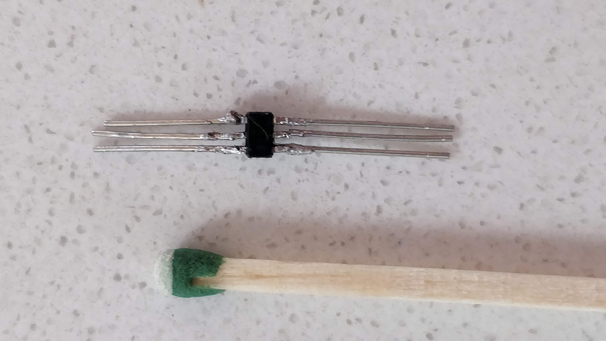
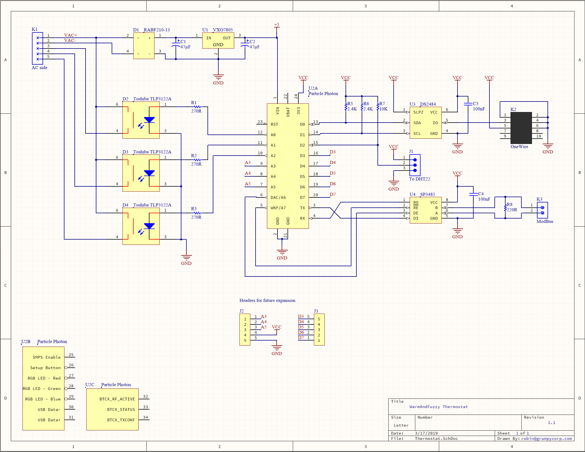

The WarmAndFuzzy thermostat is the in-room component of the [master plan](../intro/).

The primary objectives are:

1. Work reliably no matter what
2. Make temperature data available in real-time to the system at large (cloud, other thermostats, app, ...)
3. Provide a platform for increasingly intelligent control (e.g. turning on air circulation)
4. Make historical temperature data available for analysis

While we're at it, I'm adding some secondary objectives:

5. Measure loop temperatures of hydronic radiant loops at the manifolds so I can better understand system efficiency
6. Talk to our boiler over ModBus to track what it's up to, including tracking energy spent on radiant heat vs. domestic hot water

### On reliability

I think the most important trait of any IoT gadget is that it needs to be **reliable**.
I want to support and delight everyone in the house and
that starts with a system that doesn't require babysitting and doesn't fall over when the internet is out or the power gets wonky.

I also believe that the system should be revertible, i.e. I should be able to return some or all of the house
to the current "dumb" thermostats with minimal effort,
adding to the sense of psychological safety I'd like my family to enjoy while they watch me dork with core life-supporting systems.

## Design choices

I'm designing a thermostat board to accomplish the above objectives with the following:

- An IoT-enabled SoC core to talk to the internet when we need to while still containing all required logic and configuration locally (reliability!)
- 24VAC-sourced power (i.e. what the heating/heat pump systems provide at each thermostat site per [my system rework](/posts/crafting/radiant-rework/))
- An on-board temperature and humidity sensor (humidity for good measure)
- Three relays for 24VAC-based control (call for heat, cooling, and circulation, respectively)
- An off-board temperature sensor topology to measure radiant loop temperatures
- ModBus (RS485) support
- Header pads connected to unused GPIO pins for future additions

This will make for a multi-purpose board that I can use in-wall/in-room as a thermostat (with the on-board temperature sensor)
as well as in the closets that host our radiant manifolds to report on loop temperatures.
The thermostat-destined boards just won't populate the off-board sensor components,
and the manifold-destined boards just won't populate the on-board sensor and relay components.

### Core

I'm basing my design on the [Particle Photon](https://www.particle.io/wifi/) SoC module.

Having worked in IoT just long enough to have FOTA (firmware-over-the-air) management be my first concern,
the Particle folks are doing a really good job with this.
(Not quite as good as [Balena](https://www.balena.io/) but the Photon is smaller and cheaper than a Raspberry Pi. So, close enough.)
In brief, their stack lets me remotely update firmware without physically touching any of the devices
and that's awesome since we'll have about 25 of them tucked into walls and closets.

They also have a good `C++`-centric development model that gets me close to the metal without any undue burden,
courtesy of their [device OS](https://www.particle.io/device-os/) offering everything from primitives (e.g. _bang this bit_)
to fluffy stuff (e.g. _send this string to the cloud_ in a single line of code).
Their model is a great example of the pay-for-play/complexity-only-when-you-need-it approach to API design I champion.

It's possible to kick the board into an advanced mode to allow for dedicated threads (one for local work, one for internet-dependent work)
to insulate our system from the vagaries of the cloud.

### Power

I'm using a VXO7805 buck regulator module after a trivial bridge rectifier as a power-/thermally-efficient alternative to a _ye olde_ 7805.
I was happy to find this buck regulator + inductors combo as a pre-built module from DigiKey
since I'm trying to absolutely minimize the number of individual components on the board - I want this project done, not perfect.

I also wrestled with the idea of creating a battery-powered system using the Particle Argon/Xenon BLE mesh network.
However, building power-efficient systems is the stuff of nightmares and again, I want this project done, not perfect.
(Source: I've worked on power performance of both hardware and software professionally.)

### Sensors

I'm using the venerable DHT22/AM2302 temperature/humidity sensor for the on-board sensor.
It is the cheapest sensor that measures both temperature and humidity at okay-enough accuracy
(see [this page](http://www.kandrsmith.org/RJS/Misc/Hygrometers/calib_many.html) for a great comparison).

I'm using the equally venerable DS18B20 temperature sensor for off-board radiant loop sensing.
Even though Dallas' 1-Wire protocol seems largely abandoned this component is still kicking around
perhaps because it allows for pretty flexible daisy-chaining in a variety of topologies -
perfect for my application.

### Relays

I'm using Toshiba's TLP3122A solid state relay instead of mechanical relays since it's smaller, cheaper, and quieter.
I measured the control load of our radiant system's largest loop cluster (the common area, unsurprisingly) at 0.8A peak / 0.4A steady
and that's nicely within the 1A limit of that component.

### ModBus

I'm using the SP3485 3.3V-compatible RS485 transceiver and it's all pretty vanilla.

## Prototyping

### The good stuff

Here's a breadboard version of _most_ of the components:

Here's an action shot of the system successfully controlling my heat pump:

### The in-progress stuff

I experimented with driving two DS18B20 sensors from a shared GPIO pin, each sensor connected through its own 10' cable.
It worked for about 80% of the samples but that's not good enough (and foreboding).

The actual topology won't be a star topology with 10' long cables
(it'll be sensors hanging off about 2'-4' of ribbon cable with short (6") tails for each of them)
but it still felt like a bad idea to drive that from a puny GPIO pin.

My second experiment was with a DS2484 I2C-to-1Wire controller;
however, the darn thing is so darn tiny that I can't even get it connected.

Here we are trying to attach leads to it so I can put it into a breadboard:

Match provided for scale.

Of course the leads broke off the pins from the tiny SOT package so that was ultimately a non-starter.

In attempt #2 I tried soldering the chip to a breakout board but my solder (0.8mm) is just too big to solder the chip without bridging pins.

Attempts #3 and #4 will commence with smaller solder (0.4mm) and some desoldering wick,
as well as a DS2482 which is functionally near-identical but packaged in a slightly more forgiving SOIC package.

Soldering is not for old people, folks, and that's with a magnifying glass and doing this before the coffee kicks in.

### The absent stuff

I'm not prototyping the ModBus/RS485 component - it's trivial so it should just work (...) and worst case it's a priority six objective anyhow.
And when all else fails there's rework.

## Fabrication

Here's the current schematic (save any potential change-out in 1-Wire driver chips) created in [Altium CircuitMaker](https://circuitmaker.com):

And I did a preliminary place and auto-route to see how small a board I could get away with:

We're currently at 2.6" x 1.7" which will fit nicely inside the electrical boxes behind each of our in-wall thermostats.

I could save some space by tossing the RS485 subsystem underneath the Photon
and similarly putting the SSRs underneath the bridge rectifier and friends, but I'm not sure it's worth it. We'll see.

I just need to [keep roughly the right quarter of the Photon unencumbered](https://docs.particle.io/datasheets/wi-fi/photon-datasheet/#mechanical-specifications)
(c.f. the purple block) so as not to interfere with its WiFi antenna. The current layout admittedly isn't perfect in that regard.

## Open issues

I need to sort out the mechanical side of the 1-Wire driver chip in terms of my senescent soldering abilities,
write and verify the firmware for the chip, and then finalize the board to send off to [JLCPCB](https://www.jlcpcb.com) for manufacturing.
Stay tuned...
